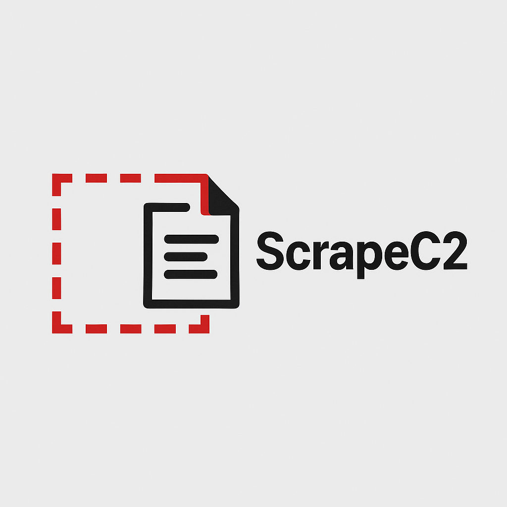

  

# ScrapeC2

**Live screen-scraping and telemetry publishing to Anduril Lattice or any modern C2 system.**

ScrapeC2 is an open-source tool that extracts position, velocity, and other telemetry data directly from on-screen displays. It's ideal for interfacing with legacy, air-gapped, or proprietary C2 systems that lack API access.

ScrapeC2 uses real-time OCR and lightweight LLM-driven parsing to:
- ✅ Detect telemetry data in formats like LLA, ECEF, NED
- ✅ Normalize data into structured output
- ✅ Publish it to **Anduril Lattice** or any downstream pipeline

---

## 🚀 Features

- 🔍 Drag-to-select capture box with real-time OCR
- 🧠 Lightweight LLM-based telemetry field recognition
- ⚡ Fast regex fallback once format is detected
- 📡 Optional socket publishing to external systems (Lattice, MQTT, etc.)
- 🖥️ Windows-native setup, no integration required from the source system

---

## 📦 Coming Soon

- GUI configuration panel
- Format profiles (LLA, ECEF, etc.)
- Direct integration modes for Anduril Lattice
- Minimal resource build (e.g. without LLM inference)

---

## 📄 License

MIT License — use freely, contribute openly.
